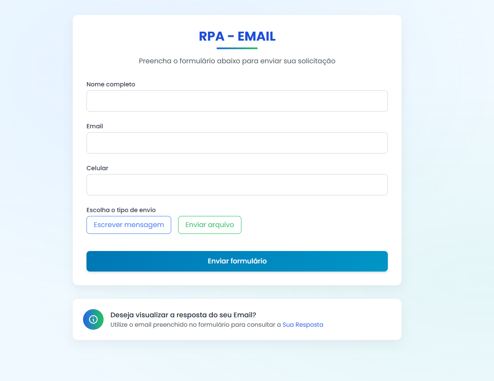
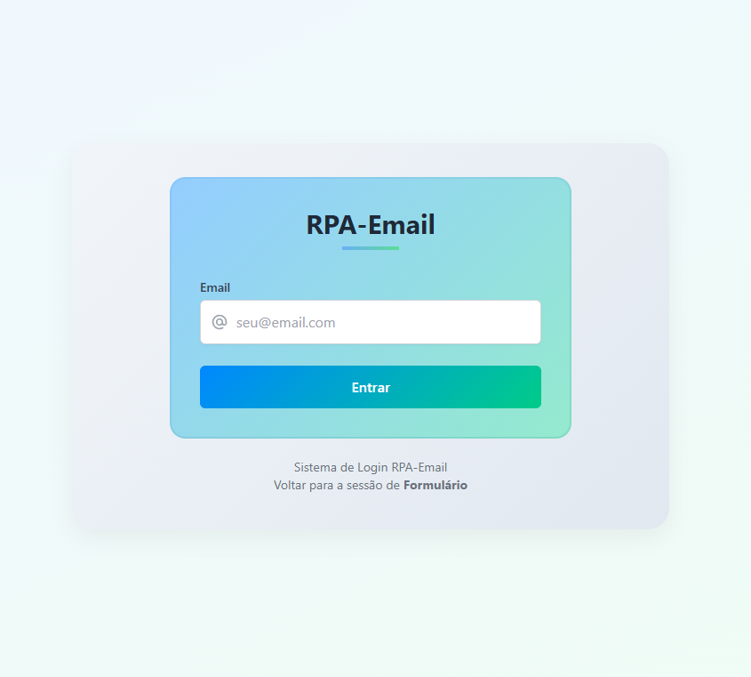
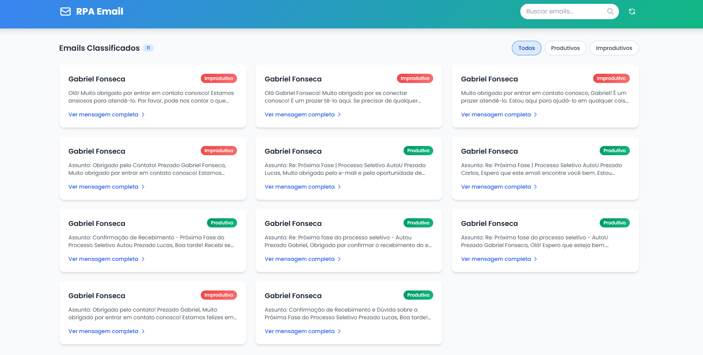
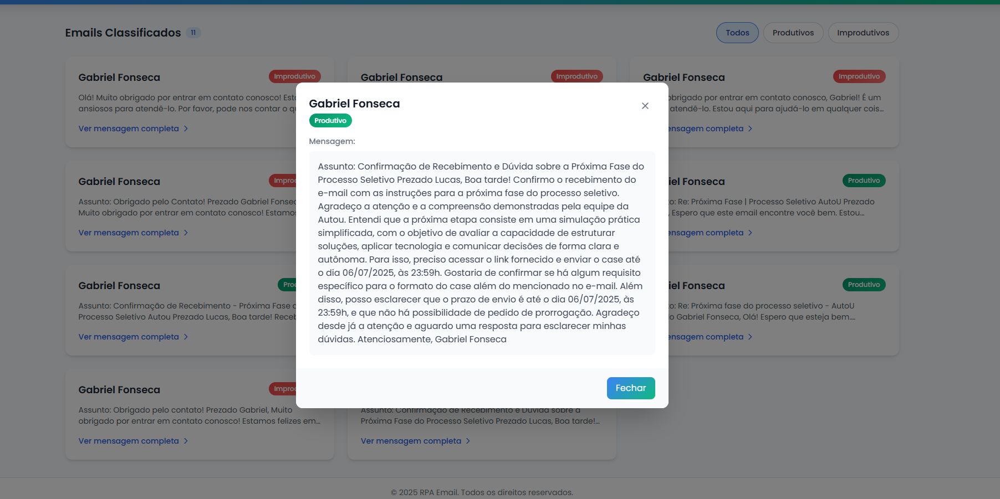

# 📧 RPA Email Assistant com IA e NLP

Sistema Web inteligente de automação de respostas a e-mails, utilizando **RPA (Automação Robótica de Processos)**, **IA generativa** e **NLP (Processamento de Linguagem Natural)**. O sistema permite que o usuário envie e-mails manualmente ou por meio de arquivos `.pdf` ou `.txt`, e retorna uma **resposta automática**, **classificação do e-mail** (produtivo ou improdutivo) e sugestões baseadas em IA.

---

## 🚀 Tecnologias Utilizadas

### 🧠 Backend (Python + Flask)
- Flask
- SQLAlchemy
- Marshmallow
- Flask-RESTful
- Flask-Migrate
- Flask-CORS
- PostgreSQL
- NLTK (pré-processamento NLP)
- PyMuPDF (leitura de PDF)
- OpenAI / Groq API (geração de respostas)

### 🌐 Frontend
- HTML5
- CSS3
- TailwindCSS
- JavaScript

---

## 🧩 Arquitetura do Projeto

```bash
src/
│
├── controller/            # Camada de controle (rotas, lógica principal)
│   ├── user.py
│   └── email.py
│
├── service/               # Regra de negócio
│   ├── user.py
│   └── email.py
│
├── model/                 # Modelo do DB
│   ├── user.py
│   └── email.py
│
├── utils/                 # Funções auxiliares (NLP, IA, leitura de arquivos)
│   ├── extract_pdf.py
│   ├── extract_txt.py
│   ├── preprocess_text.py
│   └── automatic_message_generate.py   
│   └── message_classification.py
│
├── extensions.py         # Instância de extensões (DB, Marshmallow)
│ 
│
├── routes.py             # Registro das rotas
│   
├── config.py              # Configurações de ambiente e DB
└── app.py                 # Inicialização do app Flask
```
---
## 🧪 Funcionalidades
Envio de e-mails manualmente ou por arquivo .pdf / .txt

Extração de texto dos arquivos

Pré-processamento de conteúdo com NLP (remoção de stopwords, stemming etc.)

Classificação automática do e-mail:

📌 Produtivo

🚫 Improdutivo

Geração de resposta automática personalizada com IA generativa

Armazenamento no banco de dados PostgreSQL

API RESTful estruturada


---

## 📃 Controller CreateEmail

```python
class CreateEmail(Resource):
    def post(self):
        data = json.loads(request.form.get('data'))
        file = request.files.get('file')
        message = {}
        if data:
            user = create_user(User(name=data['name'], email=data['email'], cellphone=data['cellphone']))
            
            if file:
                if file.filename.endswith('.pdf') or file.mimetype == 'application/pdf':
                    file.stream.seek(0)
                    content = extract_pdf(file)
                elif file.filename.endswith('.txt') or file.mimetype == 'text/plain':
                    content = extract_txt(file)
                
                if content:
                    processed_content = preprocess_text(content)
                    message = message_validation(processed_content, data['name'])   
                 
            if not file:
                processed_message = preprocess_text(data['message'])
                message = message_validation(processed_message, data['name'])

            email = create_email(Email(message=message['message'], classification=message['classification'], email=data['email']))

            if email and user:
                return jsonify({'success': 'Resposta ao email enviado com sucesso'})
```

## ⚙️ Configuração
🔐 .env
Crie um arquivo .env com as variáveis de ambiente do banco de dados:

```
db_schema=nome_do_banco
db_username=usuario
db_password=senha
db_host=localhost
```

## 🧾 config.py

```python
import os
from dotenv import load_dotenv

load_dotenv()

db_schema = os.getenv("db_schema")
db_username = os.getenv("db_username")
db_password = os.getenv("db_password")
db_host = os.getenv("db_host")


main_db_uri = (
    "postgresql+psycopg2://"
    + db_username
    + ":"
    + db_password
    + "@"
    + db_host
    + ":5432/"
    + db_schema
)


class Config:
    SQLALCHEMY_DATABASE_URI = main_db_uri
    SQLALCHEMY_TRACK_MODIFICATIONS = False

```

##  🔌 Inicialização da Aplicação

```python
from flask_cors import CORS
from flask_restful import Api
from src.routes import register_routes
from extensions import app, db, ma
from config import Config
from flask_migrate import Migrate

app.config.from_object(Config)
db.init_app(app)
ma.init_app(app)
migrate = Migrate(app, db)
api = Api(app)
CORS(app)
register_routes(api)
```

## 📷 Prévia da Interface
<p align="center">  </p> <p align="center">  </p> <p align="center">  </p> <p align="center">  </p>


## ☁️ Deploy

- ### Backend: `Render`
- ### Database: `Render`
- ### Frontend: `Vercel`


## ✨ Features
- ### ✅ `Suporte a envio manual e por arquivo`

- ### ✅ `Classificação inteligente de emails`

- ### ✅ `Geração de resposta automática com IA`

- ### ✅ `Integração com OpenAI e Groq`

- ### ✅ `Backend robusto e escalável`

- ### ✅ `Frontend moderno com Tailwind CSS`

- ### ✅ `Deploy com Render + Vercel`

---


# 🧑‍💻 Desenvolvedor
## Gabriel Fonseca

### 💼 Projeto pessoal com foco em IA + RPA
### 📬 gabrielfonseca.devback@email.com
### 💻 [App](https://rpa-email.vercel.app/index.html))
### 📎 [LinkedIn](https://www.linkedin.com/in/gabrielfonsecaq) • [GitHub](https://github.com/Gabfonexe) • [Portfólios](https://github.com/Gabfonexe?tab=repositories)
